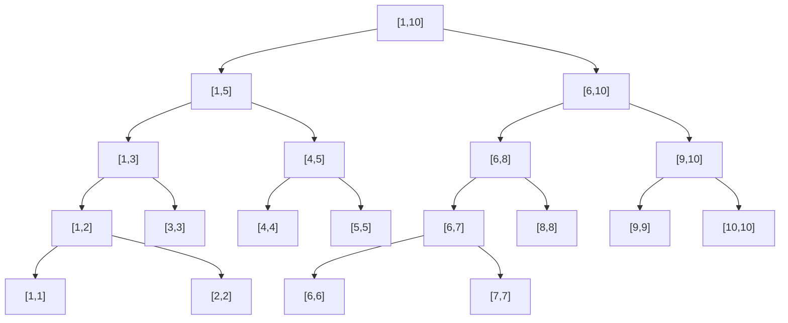

# 线段树

线段树是经典二叉树的一种,但是通过一些独特的维护操作,它可以高效地应对许多区间的操作.



## 区间修改

通过记录修改的值,可以暂时把修改局限在当前节点,直到下一次修改或者查询.

修改了一个节点的值之后应当更新其父节点及所有祖先节点的特征值

```cpp
void add(int from, int to, node& a,int val)
{
	if (from <= a.left && to >= a.right)
	{
		a.sum += val * (a.right - a.left + 1);
		a.toadd= val;
		pushUp(a);
	}
	else
	{
		if (a.l != NULL)
		{
			node& l = *(a.l);
			if (l.left <= to && l.right >= to || l.left <= from && l.right >= from || from <= l.left && to >= l.right)
			{
				add(from, to, l, val);
			}

		}
		if (a.r != NULL)
		{
			node& r = *(a.r);
			if (r.left <= to && r.right >= to || r.left <= from && r.right >= from || from <= r.left && to >= r.right)
			{
				add(from, to, r, val);
			}
		}
	}
}
```

### 更新节点的特征值

```cpp
void takeUp(node& a)
{
	a.sum = ((a.l == NULL) ? 0 : a.l->sum) + ((a.r == NULL) ? 0 : a.r->sum);
}
void pushUp(node& a)
{
	if (a.p!=NULL)
	{
		takeUp(*(a.p));
		pushUp(*(a.p));
	}
}
```

## 区间查询

查询一个节点的记录前,需要先应用其父节点所存储的操作

```cpp
int sum(int from, int to, node& a)
{
	int ans = 0;
	if (from <= a.left && to >= a.right)
	{
		ans+= a.sum;
	}
	else
	{
        pushDown(a);
		if (a.l != NULL)
		{
			node& l = *(a.l);
			if (l.left <= to && l.right >= to || l.left <= from && l.right >= from|| from <= l.left && to >= l.right)
			{
				ans += sum(from, to, l);
			}
			
		}
		if (a.r != NULL)
		{
			node& r = *(a.r);
			if (r.left <= to && r.right >= to || r.left <= from && r.right >= from|| from <= r.left && to >= r.right)
			{
				ans += sum(from, to, r);
			}
		}
	}
	return ans;
}
```

### 应用某节点存储的操作

```cpp
void pushDown(node& a)
{
	if (a.toAdd != 0)
	{
		if (a.l != NULL)
		{
			node& l = *(a.l);
			if (!isLeaf(l) && l.toAdd != 0)
			{
				pushDown(l);
			}
			l.sum += a.toAdd * (l.right - l.left + 1);
			l.toAdd = a.toAdd;
		}
		if (a.r != NULL)
		{
			node& r = *(a.r);
			if (!isLeaf(r) && r.toAdd != 0)
			{
				pushDown(r);
			}
			r.sum += a.toAdd * (r.right - r.left + 1);
			r.toAdd = a.toAdd;
		}
		a.toAdd = 0;
	}
}
```