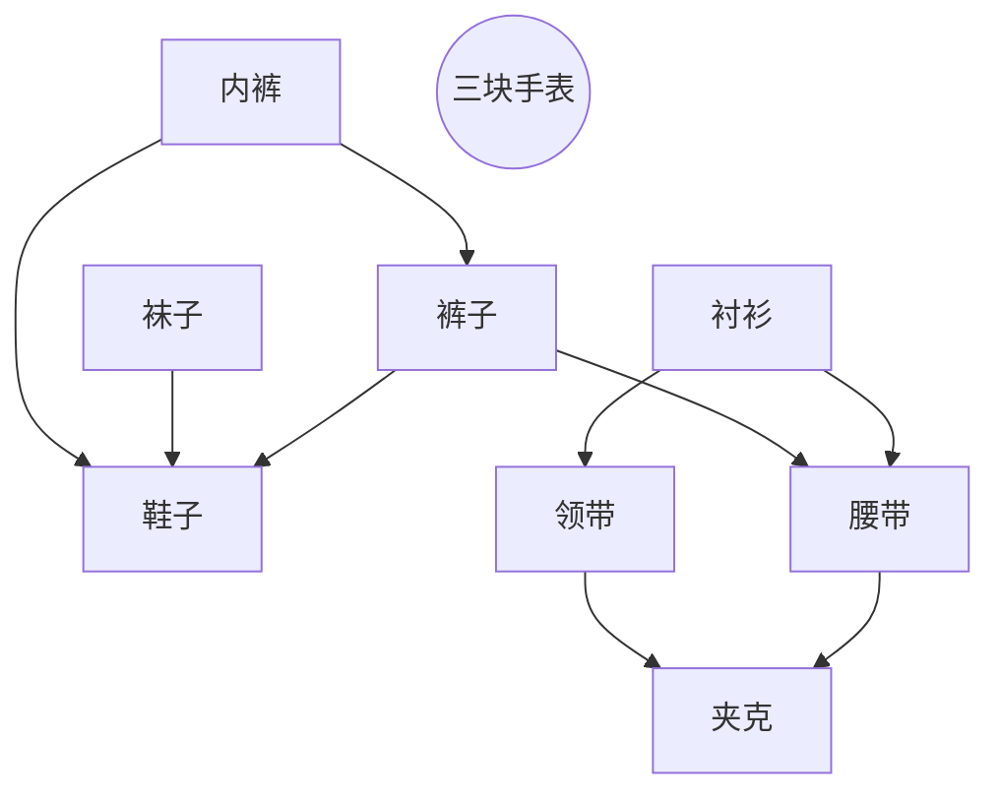

# 基本的图算法

## 表示一个图

### 数学表示

$$G=(V,E)$$

- $V$是$G$中所有节点的集合
- $E$是$G$中所有边的集合
    - 边是有序的节点对$(u,v)$,表示从$u$到$v$有一条通路
    - 有的时候,边还会有个属性$\omega$,表示权重,通过这条边的代价,或者这条边的容量$e.t.c.$

### 计算机存储

#### 邻接链表

- 对于一张图$G=(V,E)$,其邻接链表是一个链表的数组$Adj$,其大小为$\mid V \mid$
- $\forall v \in V \ v\in Adj[u] \to (u,v) \in E$
- 也就是说,$\lbrace v \mid v \in Adj[u] \rbrace  = \lbrace v \mid (u,v) \in E\rbrace$


#### 邻接矩阵

- 对于一张图$G=(V,E)$,其邻接矩阵是一个$\mid V \mid \times \mid V \mid$的矩阵$A=(a_{ij})$且

$$\forall a_{ij}\in A \ a_{ij} = \begin{cases}1 & (i,j) \in E \cr 0 & (i,j) \notin E\end{cases}$$

- 边的权重也可以直接写在邻接矩阵里

|表示方法|空间消耗|遍历某个节点的所有边的时间消耗|判断是否存在边$(u,v)$的时间消耗|
|---|---|---|---|
|邻接链表|$\Theta(\mid V \mid + \mid E \mid)$|$\Theta(\mid E \mid)$,$\mathrm{O}(\frac{\mid E \mid}{\mid V \mid})$|$\Theta(\mid E \mid)$,$\mathrm{O}(\frac{\mid E \mid}{\mid V \mid})$(二叉搜索树可优化至$\mathrm{O}(\log\frac{\mid E \mid}{\mid V \mid})$)|
|邻接矩阵|$\Theta({\mid V \mid}^2)$|$\Theta(\mid V \mid)$|$\Theta(1)$|

---

## 在图中搜索

### **广度优先搜索**(*BFS*)

>广度优先搜索是最简单的图搜索算法之一,也是许多重要算法的原型.
比如说Prim最小生成树算法,Dijkstra单源最短路算法都应用了广度优先搜索的思想.

给定图$G=(V,E)$和源点$s ( s \in V )$

- 广度优先搜索对$\forall e \in E$进行系统的探索来发现所有可以从$s$到达的节点,同时,这个算法可以计算从源点$s$到每个可达节点的最小距离(经过的边的数量)

- 广度优先搜索可以同时产生一颗"广度优先搜索树",包含所有可以从$s$到达的节点,和对应的最短路径

以上对于有向图和无向图均成立.

广度优先搜索的名字来源于它总是尽可能多的发现较近距离内的可以达到的点,然后才考虑更远的点.

```python
def BSF(G,s):
    for u in G.V - {s}:
        u.dis = INF
        u.pi = NIL
    s.dis = 0
    s.pi = NIL
    Q = emptyQqueue()
    while not Q.empty():
        u = Q.top()
        for v in G.Adj[u]:
            if v.dis == INF:
                v.dis = u.dis + 1
                v.pi = u
                Q.push(v)
        Q.pop()
```

#### 运行时间

1. 每个点最多入队一次,出队一次,出队和入队都是$\mathrm{O}(1)$的,因此队列操作耗时$\mathrm{O}(V)$

2. 每个点的邻接链表只在出队时扫描一次,一共消耗$\mathrm{O}(E)$

3. 初始化耗时$\mathrm{O}(V)$

总时间为$\mathrm{O}(V+E)$

#### 广度优先树

对于一张图$G=(V,E)$和源点$s ( s \in V )$

定义其前驱子图为:

$$G_{\pi} = ( V_{\pi} , E_{\pi})$$

$$V_{\pi} = \lbrace  v \mid v \in V \land v.\pi \neq NIL \rbrace  \cup \lbrace  s \rbrace$$

$$E_{\pi} = \lbrace  ( v.\pi , v ) \mid v \in V_{\pi} - {s} \rbrace$$

### **深度优先搜索**(*DFS*)

正如其名字表示的,深度优先搜索在有可能的情况下,先尽量"深入". 没有路了才向后回溯.

**但是**不同于广度优先搜索只发现从源点可达的的节点.   
当所有可从源点到达的点都被检查过之后,  
深度优先搜索会在还未到达的节点中随机挑一个作为新的源点来继续搜索.

>这样子规定是因为深度优先搜索通常被用作其它算法的子程序  
>而广度优先搜索一般用来计算最短路

因此,深度优先搜索得到的不是深度优先搜索树而是深度优先搜索森林.

定义其前驱子图为:

$$G_{\pi} = ( V , E_{\pi})$$

$$E_{\pi} = \lbrace  ( v.\pi , v ) \mid v \in  V \land v.\pi \neq NIL \rbrace$$

另外,对于每个节点$v \in V$,记录两个属性$v.d$和$v.f$分别为其第一次被发现的时候和完成对它的邻接表搜索的时间.  
这两个属性提供了图结构的重要信息,通常能够帮助

显然的,有:

$$\forall v \in V \ 1 \le v.d < v.f \le 2 * \mid V \mid$$

```python
time = 0

def DFS(G):
    for u in G.V:
        u.pi = NIL
    global time
    time = 0
    for u in G.V:
        if  u.pi == NIL
            DFS_VISIT(G,u)

def DFS_VISIT(G,u):
    global time
    time += 1
    u.d = time
    for v in G.Adj[u]:
        if v.pi == NIL:
            v.pi = u
            DFS_VISIT(G,v)
    time += 1
    u.f = time
```

#### 运行时间

1. 每个点正好调用一次`DFS_VISIT`,因此耗时$\mathrm{O}(V)$

2. 每个点的邻接链表只在被调用时扫描一次,一共消耗$\mathrm{O}(E)$

3. 初始化耗时$\mathrm{O}(V)$

总时间为$\mathrm{O}(V+E)$

#### *DFS*的某些性质

- 括号化定理

$$\forall (u,v) \in G.V^2 \ [ u.d , u.f ] \cap [ v.d , v.f ] = \emptyset \lor [ u.d , u.f ] \subset [ v.d , v.f ] \lor [ v.d , v.f ] \subset [ u.d , u.f ]$$

- 边的分类
    1. 树边
        - $e \in G_{\pi}.V_{\pi}$
    2. 后向边
        - $e \in \lbrace  (u,v) \mid (u,v) \notin G_{\pi}.V_{\pi} \land [v.d,v.f] \subseteq [u.d,u.f]\rbrace$
    3. 前向边
        - $e \in \lbrace  (u,v) \mid (u,v) \notin G_{\pi}.V_{\pi} \land [v.d,v.f] \supsetneq [u.d,u.f]\rbrace$
    4. 横边
        - $Anyedge \ Else$

## 拓扑排序

>给出一张保证无环的有向图  
>输出一个节点的排列使得  
>对于任何一条边,其源点在终点之前

比如说,穿衣的顺序:



解法:

```python
def topologicalSort(G):
    DFS(G)
    G.V.sort(key = f,reverse = True )
    return G.V
```

### 时间消耗

1. `DFS(G)`是$\mathrm{O}(V+E)$
2. 由于可以提供在每个点返回时(计算出$u.f$时)直接将其放入队伍末端,排序为$\mathrm{O}(V)$

总时间为$\mathrm{O}(V+E)$

## 强连通分量

>有向图$G=(V,E)$的一个强连通分量指一个极大的点集$C \subseteq G.V$,$C$中每一对点之间都可以互相到达.

>之所以求强连通分量十分重要,是因为它可以在许多算法中用来将强连通分量缩成点,大大降低时间消耗.

比如

```mermaid
graph LR

subgraph 
a-->b
e-->a
b-->e
end

subgraph 
c-->d
d-->c
end

b-->c

subgraph 
f-->g
g-->f
end

b-->f
c-->g
g-->h

subgraph 
h-->h
end
```

在寻找强连通分量的时候,会用到一个有趣的东西,图$G$的转置$G^T$.

$$G^{T} = (V ,E^{T})$$
$$E^T = \lbrace  (u,v) \mid (v,u) \in E \rbrace $$

就是把图$G$的每一条边都转过来.

这个操作有趣在$G$和$G^T$有完全相同的强连通分量

```python

def generateGT(G):
    GT = G
    for e in G.E:
        e.reverse()
    return GT

def strongConnectedComponents(G):
    
    GT = G
    GT.V = topologicalSort(G).reverse()
    GT = generateGT(GT)
    DFS(GT)
    ans = []
    for v in GT.V:
        if  v.pi == NIL:
            ans.append(v)
    return ans

```

以返回的节点为根的深度优先搜索树即为强连通分量.

### 正确性

这个算法的正确性来源于分量图

$$G^{SCC} = (V^{SCC},E^{SCC})$$

的一个重要性质

假定$C_1 , C_2 , \cdots ,C_k$为图$G$的所有强连通分量.而每一个$V^{SCC}$中的节点$v_i$都对应一个强连通分量$C_i$.

对于边,$\forall (i,j) \in E^{SCC} \ ( \exists v_i \in V^{SCC} \exists v_j \in V^{SCC} \ ( v_i , v_j ) \in V )$

- 上面提到的重要性质即为$G^{SCC}$必为**有向无环图**

因为有环的话,环上每一个分量都可以互相到达,可以组成更大的强连通分量,与预设矛盾了.

---

下面要论及节点和节点集合的发现以及完成时间,由于执行了两次`DFS`(第一次在拓扑排序里面),为了避免模糊,现明确以下均指第一次`DFS(G)`的发现以及完成时间.

现在将发现时间与完成时间的概念推广到点集上.

对于点集$C \subseteq V$ ,定义其完成时间为$f(C) = \max_{ u \in C}{u.f}$,发现时间为$d(C) = \min_{u \in C}{u.d}$

- 有$\forall C_i , C_j \in V^{SCC} \ \exists v_i \leadsto  v_j \ in \ G \to f(C_i) > f(C_j)$

根据先发现哪个强连通分量中的点而分为两种情况来讨论

1. 如果$d(C_i) < d(C_j)$
    
    - 假设$x$是$C_i$中最早被发现的节点
    
        - 很明显,$x$是$C_i$中所有点的祖先节点
    
    - 由于存在从$C_i$到$C_j$的路径且这时$C_j$还完全没有被发现
    
        - 所以$x$是$C_j$中所有点的祖先节点.
    
    根据括号化定理,$x$会最后返回且$f(C_i) = x.f$,定理成立.

2. 如果$d(C_i) > d(C_j)$

    - 假设$y$是$C_j$中最早被发现的节点,又有从$y$可以走到$C_j$中每一点
    
        - $y$是$C_j$中所有点的祖先节点,根据括号化定理$f(C_j) = y.f$

    - 由于存在$v_i \leadsto  v_j$
    
        - 所以不存在$v_j \leadsto  v_i$

            - 所以$y$完成时$C_i$还是没有被发现.

    有$f(C_j) < d(C_i) < f(C_i)$,定理成立

---

在转置图上

- 有$\forall C_i , C_j \in V^{SCC} \ \exists v_i \leadsto  v_j \ in \ G^T \to f(C_i) < f(C_j)$

- 转置图与原图有完全相同的强连通分量

- 又$\exists v_i \leadsto  v_j \ in \ G^T \Leftrightarrow \exists v_j \leadsto  v_i \ in \ G$

**进一步的,在转置图上,$f(C_i) > f(C_j)$可得到$v_i \leadsto  v_j$不存在.**

---

因为后面按照$f$的逆序来进行`DFS`,所以每一次在深度优先搜索森林中新建一棵树时,其它的强连通分量要么已经完全被发现,要么没有路,因此,这棵树就是一个独立的强连通分量.

### 时间消耗

1. 拓扑排序$\mathrm{O}(V+E)$

2. `DFS`$\mathrm{O}(V+E)$

总时间$\mathrm{O}(V+E)$

## 衔接点

>衔接点指这样的点,它处在一张连通的无向图中,如果将其删去,则图不再连通.

有

- $u \in G \land u.\pi = NIL \land \exists v_1 \ v_2 \in G_{\pi} \ (u,v_1) , (u,v_2) \in E_{\pi} \to u$ 是衔接点

- 如果$u$不是根节点,当且仅当$u$有子节点且没有从其子节点或后代节点指向其祖先的后向边.

定义

$$u.low = \begin{cases}u.d \cr \omega .d & \exists (v,\omega) v \ is \ children\ of\ u\ and\ \omega \ is \ father \ of \ u \end{cases}$$

计算时先`DFS`,记录发现的后向边,利用记录的$u.\pi$回溯.

衔接点就是回溯时没有碰到又有足够的子节点的点.

连通图有$V \le E - 1$

时间是$\mathrm{O}(E)$的

