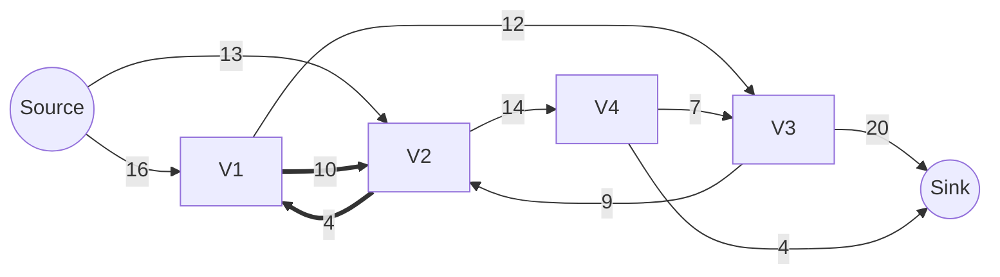
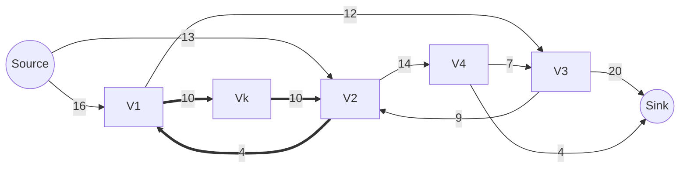
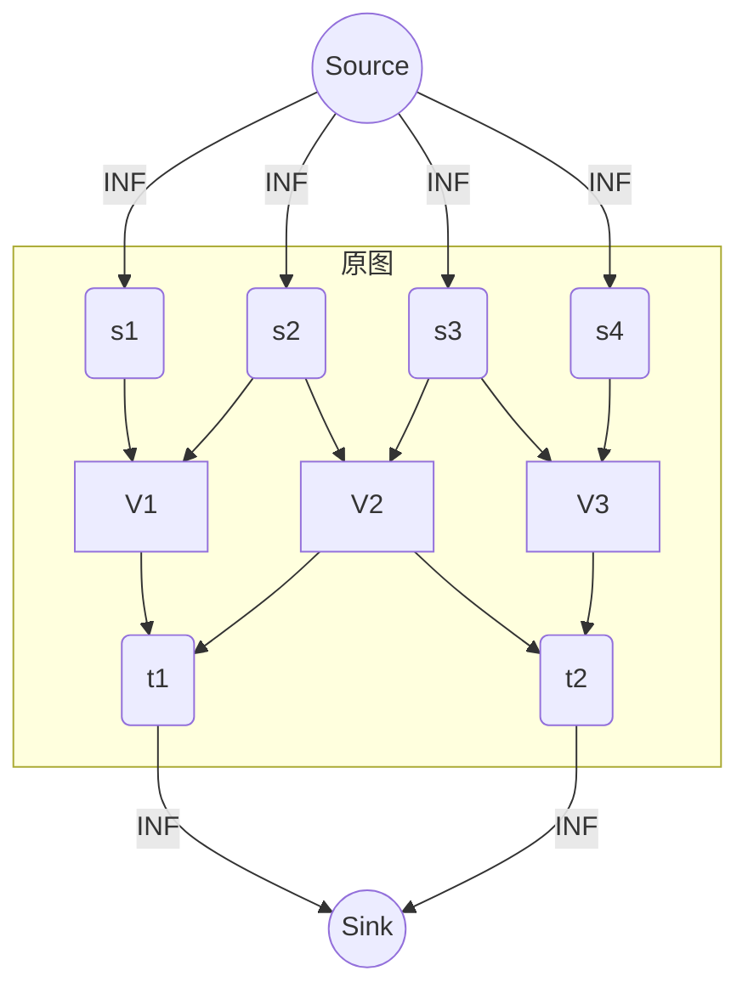
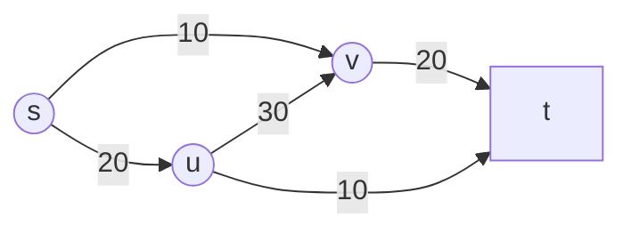
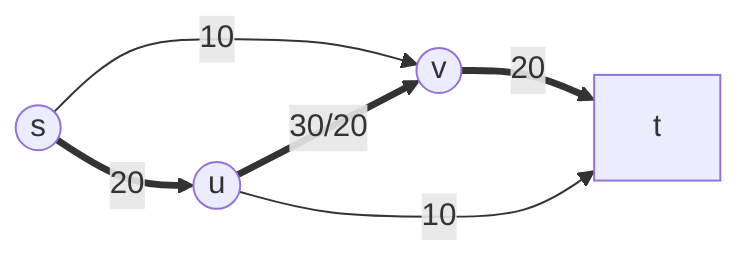
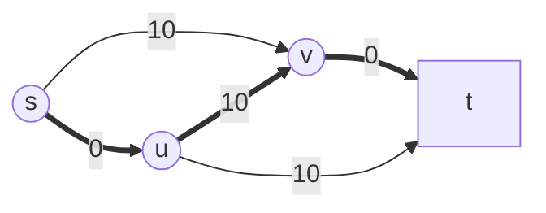
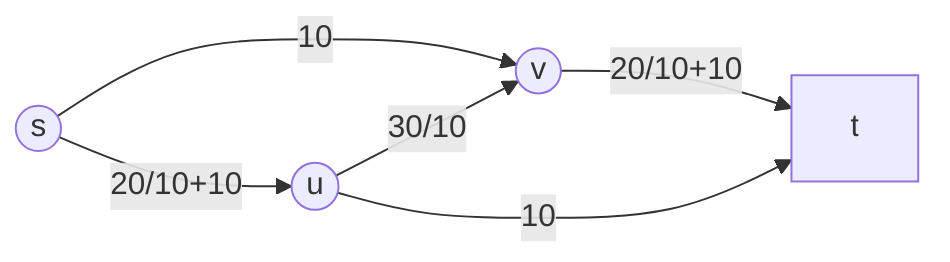

# 最大流

## 定义

**流网络**$G = (V,E)$是一个有向图

它具有一个容量函数$c$

$$
c(u,v) \textrm{ satisfy}
\begin{cases}
c(u,v) \geq 0 &(u,v)\in E\\
c(u,v) = 0&(u,v)\notin E\\
\end{cases}
$$

除此之外,还有些限制,比如说:

- $\forall (u,v)\in E,(v,u)\notin E$

- $\forall u\in V,(u,u)\notin E$

在流网络中,还有两个特殊的节点:源点$s$和汇点$t$

另外,为了简洁起见,我们假设

$$
\forall v\in {V}-{\{s,t\}},\exist p_{s \ v} \land \exist p_{v \ t}
$$

凡是不满足这个假设的点和其涉及的边,我们可以之间从图中排除,反正他们对答案没有贡献

### 补充

虽然为了算法的方便,我们禁止了$(u,v)$和$(v,u)$这样的 ***反平行*** 边同时出现,但是现实中是有可能的,但是这不成问题,请看下图.

可见,这样的限制是可以绕过的.

另外,多个源点和汇点的情形也不成问题:

当然,还有许多变体,比如说节点有容量限制之类的,但是这些变体通常可以转化为标准的网络流模型,只要弄明白如何修改原图以满足设定.

### 输入

输入一张以邻接链表表示的图$G$和对应的容量函数$c$

### 输出

通过网络流算法,我们最终得到关于这个网络最多能传递多少流量以及这个网络在承载这样的流量时具体的在每条边中的流动情况.数学的讲,返回的是一个函数$f:E\to \Re$代表这条边所承载的流量  
不过为了方便,将定义域进行扩充为$f:V\times V\to \Re$   
并且定义两个流量函数的衍生函数$f^{out}:V\to \Re$和$f^{in}:V\to \Re$意为从某节点离开或者进入某节点的流量.  
它们满足:

1. $\forall e \in E,0\leq f(e) \leq c(e)$即不可超过容量限制

2. $\forall v \in V-\{s,t\},f^{out}(v)=f^{in}(v)$即为任何除源点和汇点以外的点流量守恒,类似$Kirchhof\!f\ Circuit\ Laws$.

3. $f^{out}(s)=f^{in}(t)$即网络没有容量损失(这是上一条的一个重要推论)

具体的,通常返回一个$\mid V \mid \times \mid V \mid$的矩阵,如果题目不要求,也可直接返回$f^{in}(t)$的值

## $Ford\! -\! Fulkerson$算法

### 思路

简单考虑可以发现,网络流似乎并不符合最优子结构的性质,因此,~~动态规划~~.  

回顾之前的最短路径算法,都是先假设节点间的路径长度为无穷大,然后逐步迭代,得到最优路径.

那么,在网络流中,我们就可以假设我们初始的流量函数为$\forall e \in E , f(e)=0$,然后开始我的迭代.

对于我的迭代来说,有一个很重要的信息,就是这个网络还有多少潜力可以榨取.  
因此产生了 ***剩余网络(The Residual Graph)*** 的概念.

>剩余网路是原图$G = (V,E)$和某一时刻的流量函数$f$的一个衍生产物  
>由于具有和原图完全一致的拓扑结构,我们甚至可以认为剩余网络是一个新的容量函数$c_{f}$

$$c_{f}(e)=c(e)-f(e)$$

这里注意到一个有趣的情况,不管我从那个新的$c_{f}$榨出多少新的潜力$f^{c_{f}}$,我一定能$f+f^{c_{f}}$得到一个新的合法的流量函数.

那么,我只要能从任意的容量函数榨出一个合法的流,然后就可以 *Call it a day*

比如说,直接找到一条容量不为零的路径,将路径涉及的边的流量认为是路径上容量的最小值.

但是尝试了一下,这个策略出问题了.

为了减少迭代的轮数,选择了优先大容量路径的策略,就会这样:

我的剩余网络看上去就是这样:

没有可行的$p_{s \ t}$了,但是,明显可以看出,这不是最优解:

我得想个更好的办法来选取新的路径.