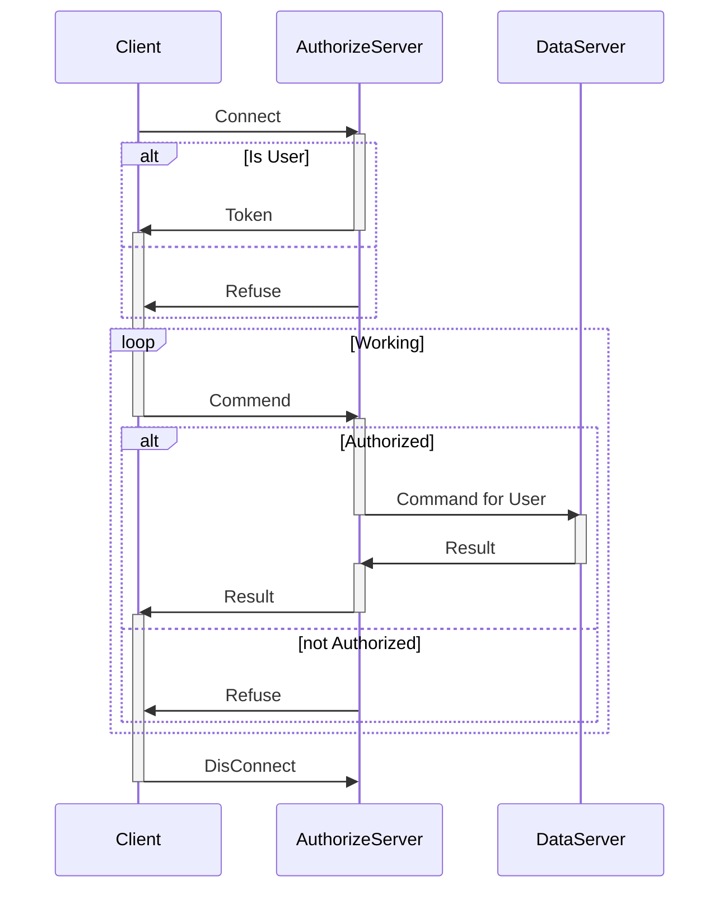

```SQL
select name , class where sex = male
select name , grade("math") where class = "ComputerScience"
select distinct class where college = "Computer and Software"
insert ("Wang Xuyang" , ...)
insert (name , ...) value ("Wang Xuyang")
set grade("math") = (6,76) where ...
delete where ...#forbid delete without where
```