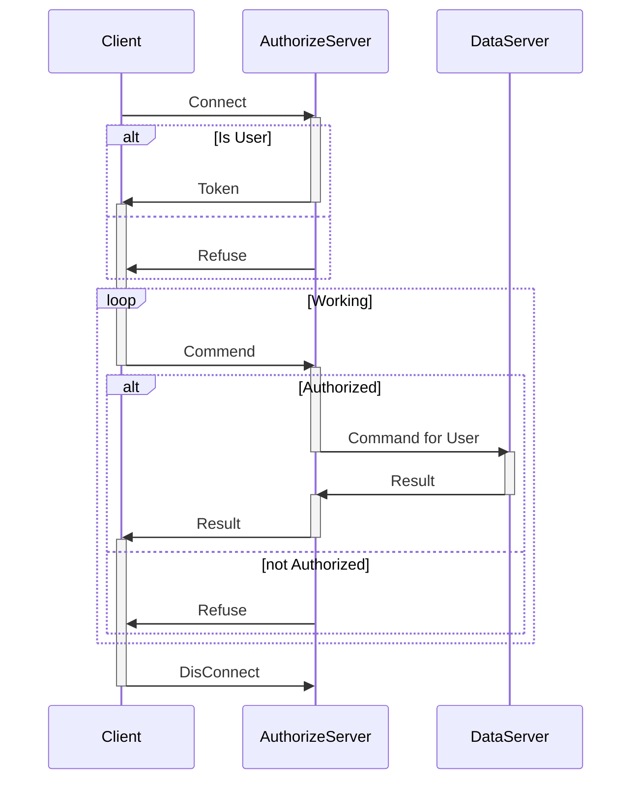
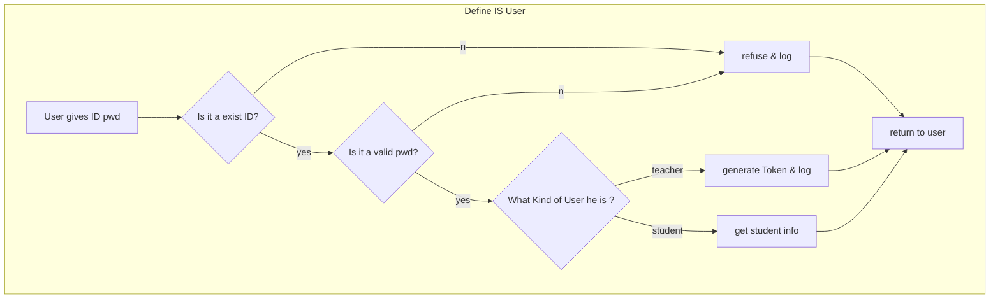

```mermaid
sequenceDiagram
    participant C as Client
    participant A as AuthorizeServer
    participant D as DataServer

C->>A:Connect
activate A
alt Is User
    A->>C:Token
    deactivate A
    activate C
else
    A->>C:Refuse
end
loop Working
    C->>A:Commend
    deactivate C
    activate A
    alt Authorized
        A->>D:Command for User
        deactivate A
        activate D
        D->>-A:Result
        activate A
        A->>C:Result
        deactivate A
        activate C
    else not Authorized
        A->>C:Refuse
    end
end
C->>A:DisConnect
deactivate C

```

```mermaid
graph TB
subgraph Define IS User
S[User gives ID pwd]
CID{Is it a exist ID?}
CWD{Is it a valid pwd?}
GTP{What Kind of User he is ?}
GUF[get student info]
GTK[generate Token & log]
R[refuse & log]
END[return to user]
S-->CID
CID--yes-->CWD
CID--no-->R
CWD--yes-->GTP
CWD--no-->R
R-->END
GTP--student-->GUF
GTP--teacher-->GTK

GTK-->END
GUF-->END
end
```

```mermaid
subgraph define Authorized
S[User gives cmd & token]
end
```