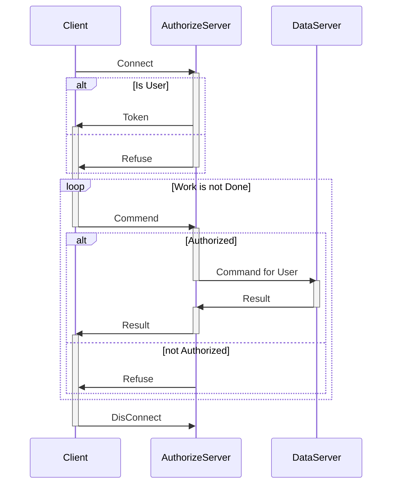

```mermaid
sequenceDiagram
    participant C as Client
    participant A as AuthorizeServer
    participant D as DataServer

C->>A:Connect
activate A
alt Is User
    A->>C:Token
    activate C
else
    A->>C:Refuse
    deactivate A
end
loop Work is not Done
    C->>A:Commend
    deactivate C
    activate A
    alt Authorized
        A->>D:Command for User
        deactivate A
        activate D
        D->>-A:Result
        activate A
        A->>C:Result
        deactivate A
        activate C
    else not Authorized
        A->>C:Refuse
    end
end
C->>A:DisConnect
deactivate C

```