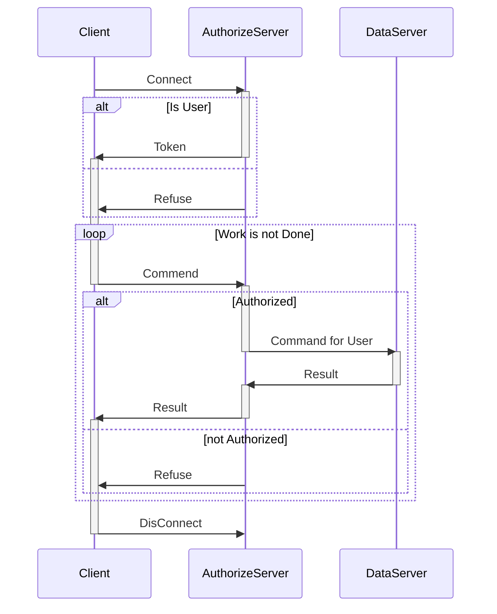

```mermaid
classDiagram
class User
class Student
class StudentList
class BaseIndex
class MapIndex
class OtherIndex
class preBuildHashFun
class Server
class Point
class Grade
User : ID
User : Token
User : public exec(cmd)
User : public User(ID,pwd)
Student : name
Student : stuID
Student : class
Student : grade
Student : ...
Student o-- Grade
StudentList : private students : map hashStuID Student
StudentList : private indexs : map indexName BaseIndex
StudentList : public StudentList()
StudentList : public addStudent(list)//single is list with one element
StudentList : public removeStuent(list)
StudentList : public buildIndex(name)
StudentList o-- Student
StudentList o-- BaseIndex
StudentList --* preBuildHashFun : buildIndex(name)
BaseIndex : fun GetKey
BaseIndex : public pure virtual vec of hashStuID search(key)
BaseIndex : public pure virtual BaseIndex(StudentList,getKey(Student))
BaseIndex : public getKey(Student)
BaseIndex : public indexStu(Student)
BaseIndex : public unindexStu(Student)
BaseIndex <|-- MapIndex
BaseIndex <|-- OtherIndex
preBuildHashFun : map : name getKey
MapIndex : private map key hashStuID
Server : private HOST
Server : private map ID,token
Server : private studentList
Server : public token login(ID,pwd)
Server : private string execByHost(cmd,ID,token)
User ..> Server : User() login()
Point : grade
Point : classHour
Point : stastic Point gpa(vec of Point)
Grade : private map : objectName Point
Grade : public setGrade(objecName,Point)
Grade : public Point getGrade(objecName)
Grade o-- Point
```