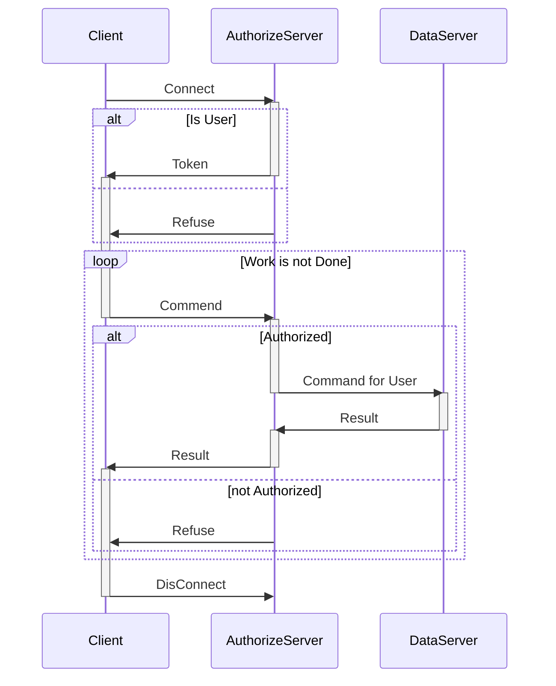
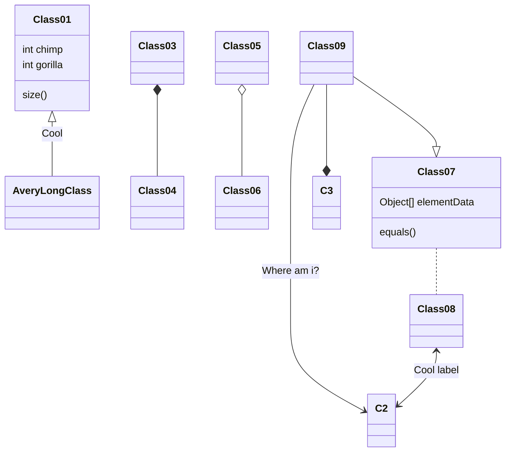

```mermaid
sequenceDiagram
    participant C as Client
    participant A as AuthorizeServer
    participant D as DataServer

C->>A:Connect
activate A
alt Is User
    A->>C:Token
    deactivate A
    activate C
else
    A->>C:Refuse
end
loop Work is not Done
    C->>A:Commend
    deactivate C
    activate A
    alt Authorized
        A->>D:Command for User
        deactivate A
        activate D
        D->>-A:Result
        activate A
        A->>C:Result
        deactivate A
        activate C
    else not Authorized
        A->>C:Refuse
    end
end
C->>A:DisConnect
deactivate C

```

```mermaid
classDiagram
Class01 <|-- AveryLongClass : Cool
Class03 *-- Class04
Class05 o-- Class06
Class07 .. Class08
Class09 --> C2 : Where am i?
Class09 --* C3
Class09 --|> Class07
Class07 : equals()
Class07 : Object[] elementData
Class01 : size()
Class01 : int chimp
Class01 : int gorilla
Class08 <--> C2: Cool label
```