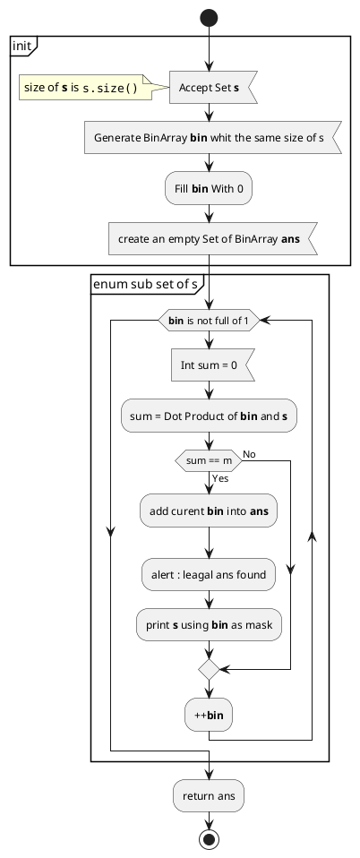
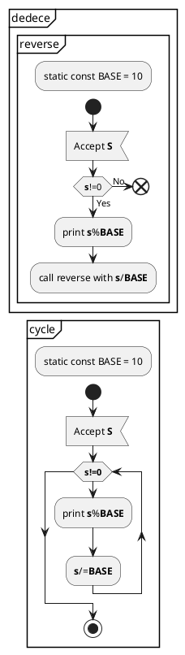

# Float Chart

>Algorithm Homework too

```plantuml
@startuml
start
partition init {
  :Accept Set **s**<
  note:size of **s** is ""s.size()""
  :Generate BinArray **bin** whit the same size of s<
  :Fill **bin** With 0;
  :create an empty Set of BinArray **ans**<
}
partition "enum sub set of s"{
  while(**bin** is not full of 1)
    :Int sum = 0<
    :sum = Dot Product of **bin** and **s**;
    if (sum == m)then(Yes)
      :add curent **bin** into **ans**;
      :alert : leagal ans found;
      :print **s** using **bin** as mask;
    else(No)
    endif
    :++**bin**;
  end while
}
:return ans;
stop

@enduml
```

```plantuml
@startuml
partition dedece {
  partition reverse {
    :static const BASE = 10;
    detach
    start
    :Accept **S**<
    if(**s**!=0)then(Yes)
      :print **s**%**BASE**;
      :call reverse with **s**/**BASE**;
      detach
    else(No)
    end
    endif
  }
}
partition cycle {
  :static const BASE = 10;
  detach
  start
  :Accept **S**<
  while(**s!=0**)
    :print **s**%**BASE**;
    :**s**/=**BASE**;
  endwhile
  stop
}
@enduml
```
