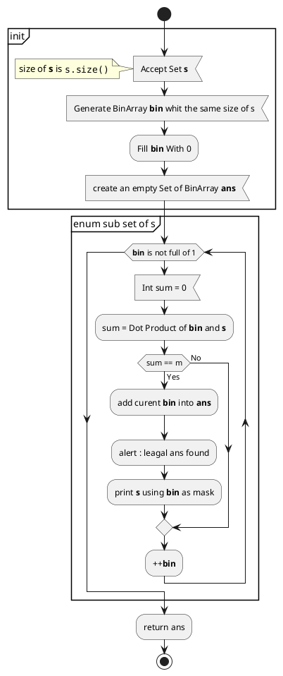
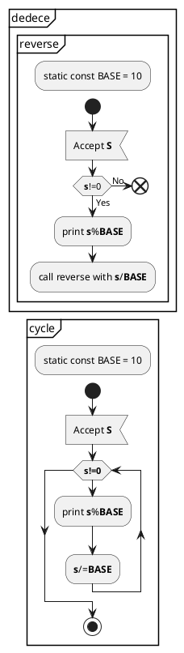

# Float Chart

>Algorithm Homework too





```puml
|出库单|
|合同管理|
|付款单|
|合同管理|

start
:签订销售合同;
:核对合同;
fork
|出库单|
:核对货物清单;
if (检查货物数量) then (有货)
:签发发货单]
else (无货)
end
endif
forkagain
|付款单|
:核对付款单;
if (付款情况) then (已付讫)
:签发付款单;
else
end
endif
|合同管理|
endfork

:发货;
:合同履约;
split
end
split again
-[#555,dotted]->
:合同存档]
detach
endsplit
```

```puml
|tech forks|
|salesperson|
|consultant|
start
|salesperson|
:call client;
:set up appointment;
if (location) then (on site)
|tech forks|
:prepare conference room;
else (offsite)
|consultant|
:prepaer on laptop;
endif
|salesperson|
fork
|tech forks|
:meet customer;
forkagain
|salesperson|
:meet customer;
forkagain
|consultant|
:meet customer;
|salesperson|
endfork
:follow up;
if (problem) then
-[]->
else(has one)
|consultant|
:proposal;
endif
end
```
