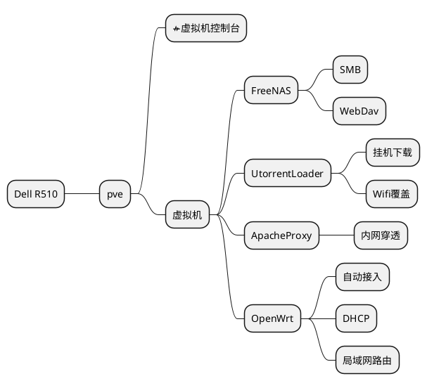

# 我的服务器

## 网络

```puml
scale 0.8
cloud {
(i-NUIST) as eth
}

package "Dell R510"{
  package "Phy Eth"{
    (eno1) as pe1
    note bottom: 物理接口1
    (eno2) as pe2
    note bottom: 物理接口2
  }
  package "Vir Eth"{
    (vmbr0) as ve0
    note right: 虚拟交换机0
    (vmbr1) as ve1
    note left: 虚拟交换机1
  }
  node "FreeNAS" as fn{
    note "10.0.3.2\n82:D3:CB:40:D9:8F" as fnaddr
    [WebDav] as WebDav
    note bottom : port 8080
    [SMB] as smb
    note bottom : port 445
    [WebConsle] as fnwc
    note bottom : port 80
  }
  node ApacheProxy as ap{
    note "10.0.3.4\n8A:03:89:2E:76:C7" as apaddr
    cloud {
      (gkdgkd.online) as gkd
    }
    [sakuar] as sa
    sa <.> gkd
  }
  node UtorrentLoader as ul{
    note "10.0.129\nAA:97:FB:90:4D:FF" as uladdr
    [Wifi] as wifi
    note top : HG-508
  }
  node "OpenWrt" as ow{
    (lan)
    note top : 10.0.3.16\nAE:05:B9:A478:A6
    (wan)
    note top : A6:FA:44:C5:6C:13
    (lan) <-> (wan)
  }
  node pve{
    [WebConsle] as wc
    note "10.0.3.1" as pveaddr
  }
  ve0 <-d--> pe2
  ve1 <-d--> pe1
  ve0 <-u-> lan
  ve1 <-u-> wan
  sa <.-> WebDav
  fn <--> ve0
  ap <--> ve0
  ul <--> ve0
  pve <--> ve0
}
package "DeskTop" as client{
    package "Client Phy Eth"{
    (built in) as cpe1
    (add on) as cpe2
  }
}

pe2 <-u-> cpe2
pe1 -u-> eth
```

## 存储

```puml
scale 0.8

package "Dell R510"{
  package Disks as disks{
    (WD20EZAZ) as WXT2A10NH7JL
    note top: WXT2A10NH7JL
    (WD20EZAZ) as WX21AC9HAJ04
    note top : WX21AC9HAJ04
    (WD20EZAZ) as WX41AC9PEC09
    note top : WX41AC9PEC09
    (WD10EZEX) as WCC6Y3ZDVEUE
    note top : WCC6Y3ZDVEUE
    (WD10EZEX) as WCC3F7NTJDSP
    note top : WCC3F7NTJDSP
    (ST320LT014-9YK142) as W0Q4GZ9S
    note top : W0Q4GZ9S
  }
  database "VM-Vault" as vvault
    note right : ZFS\nmirror
  node "FreeNAS" as fn{
    [WebDav] as WebDav
    [SMB] as smb
    database Vault
    note left : ZFS\nraidz1
    Vault <== smb
    Vault <== WebDav
  }
  node ApacheProxy as ap{
  }
  node UtorrentLoader as ul{
    [utorrent]
  }
  node "OpenWrt" as ow{
  }
  node pve{
  }

  WXT2A10NH7JL <== Vault #Black
  WX21AC9HAJ04 <== Vault #Black
  WX41AC9PEC09 <== Vault #Black
  WCC6Y3ZDVEUE <== vvault #Black
  WCC3F7NTJDSP <== vvault #Black
  W0Q4GZ9S <=== pve #Black
  vvault <== fn #Black
  vvault <== ap #Black
  vvault <== ul #Black
  vvault <== ow #Black
  smb <== utorrent #Black
}
package "DeskTop" as client{
(WDS500G2B0C-00PXH0)
note top : NVMe\n37E32D21-3D28-4A17-9314-EB12E0FA0FFB
(WD10EZEX-75M2NA0)
note top : SATA HDD\n00064560
(挂载) as cmnt
}
smb <=u= cmnt #Black
```

## 服务


