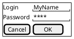
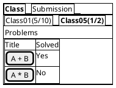
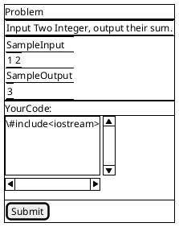
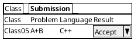
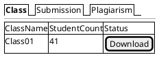
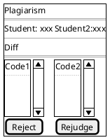

npm# Software Requirement analysis Of Programing Online Judge System

by HuGuang(201883290072) at 2021-1-7
[toc]

## Introduction

### Background

The programming has become more and more inportant,and many school are taking programing into their courses. This raise the question of how to judge student's homework and so on. As the complexity of program and programming language, it is a nightmare for teachers to evaluate by bare hand. A favorable fact is that many automated test system has been developed to provide information about the quality of a program. However those auto test soltution didn't take vandalism or cheat into consideration. Thus we need to provide a system that able to evaluate the correctness of the program written by students.

This system will be used by teachers and students of school of computer science first.After valdiated, it will be adopted to all programming course of XX university.

### Purpose of the system

This system should be able to evaluate the correctness of given program with spcified test cases. Additional, the system should be robust to malicious code and has the ability to detect plagiarism.

### Context of the system

This system should provide access by web browser.

This systemt should provide means to import students account and export their results.

Problems should be stored in plain text and teachers should be able to edit them with regular texteditor. So does the test case.

This system has a predecessor implemented with python and c++ and contains valuable history data that must be succeeded.

## Bussiness Modelling

### System request

This system should be able to sotre and present problems which can be solved with programming, and system can automatically detect the correctness of submitted code.

The results of those submissions should be able to exported for further purpose.

It's worth noting that this system should be able to protect itself and porblems from malicious code.

This system can reduce the time teachers spent on examining the code submitted by students and allow students get fed back instantly. This can improve the efficiency of studying and teaching.

This system is sponsored by school of computer science.

### Feasibility study

The benefit of this system is improve the efficiency of teaching programming language and courses like algroithm.

The challenge of this project is devided to two parts.

The main challenge is how to judge submitted code automaticly and safely.

The second challenge is how to reduce the cost of auto judge.

The budget of this project is not a problem based on the cost of the predecessor.

As a replacement of paper homework and exam, the introduction of this system may have some infulence on the usual process of related course.

### Bussiness process modelling

As a usual way of homework. First, teachers prepare problems in davance. Then , they distribute the problems to students. After students subbmitted their answers, teachers exam those answers and give a result.

```puml
|teacher|
start
:Prepare Problems;
:Select and distribute problems;
|students|
:try to solve problems;
:submit answers;
|teacher|
:judge the answer and give score;
stop
```

With same process, exam can be handled similarly.

In this system, the process is a little different. The judge will be done by the system automaticly.

#### prepaering the problems

```puml
|teacher|
start
while (Prepare Problems)
:prepare statements;
:prepare test cases and standard answer;
|system|
if (check standard answer and test cases) then (Correct)
:store the problems;
end
else (Invalid)
:Refuse the problem;
endif
endwhile
|teacher|
stop
```

With this new system,when a new problem is created, the system will automatically check the standard answer against the test cases. and refuse to create if the check fails.

#### distribute problems

Usually , teacher will give homework to the whole class.
So, this system devided this part to two step. Create a class first and then distribute problems to this class.

```puml
|teacher|
start
:prepare the list of students in the class;
:submit the list of students;
|system|
:create class;
while (for students in list)
if (student exists) then (exists)
else (not exists)
:create student;
endif
:add to class;
endwhile
:store class;
end
```

```puml
|teacher|
:select class;
:select problems;
|system|
:add problems to class;
```

#### show problem to student and gather submittion

A student can list the classes that include him/her and read the statements of the problems included in the classes.

```puml

|system|
start
:list classes;
:list problems;
|student|
:solve one;
:submit answer;
|system|
if (check for plagiarism) then (found)
:refuse to judge and log;
end
else (not found)
:get testcase;
:check submission with testcase;
:store result;
if (class config allow show results)then
end;
else
:show result;
|student|
end
endif
```

#### deal with plagiarism

After a student submitted his/her solution, the system will try to find any similer code which indicates plagiarism.If any found,system will alert the teacher.

```puml
|teacher|
|system|
:read from log;
:find similer submission;
|teacher|
:compare the student submission;
:query student if necessary;
if (is plagiarism) then (is plagiarism)
:issue punishment;
end;
else (isn't plagiarism)
|system|
:judge the submission;
:store result;
end
```

#### export results

At any time, the teacher can export the data from his class.

```puml
|teacher|
|system|
:list classes;
|teacher|
:select one class;
|system|
:generate report;
|teacher|
:download report;
```

### Domain modelling

In this systemq, User is devided into two categories student and teacher.
Teacher has the authority to create student, class and problems.
Students can make submission.

```puml
class User{
  +username
  -passwordHash
  +static Hash()
  +isCorrectPassword(Pass)
}

class Teacher{
  Class& classes[]
  Plagiarism& plagiarismToHandle[]
}
class Student{
  Submission submissions[]
}

User <|-- Teacher
User <|-- Student
```

A submission has many status, like Judging and Judged.
A submission can be be judged for many times thus can have many judge result.

```puml
class Problem{
  +Statement
}
class Submission{
  +Language
  +Code
  +Date
  +Student&
}
class JudgeResult{
  +Time
  +Memory
  +Result
  +Status
  +Result
  +Date
}
Problem "1" -- "n" Submission
Submission "1" - "n" JudgeResult
```

For convenience, we have class which is a group of students.

```puml
class Class{
  +Student& students[]
}
```

OverAll, the class diagram looks like this.

```puml
class User{
  +username
  -passwordHash
  +static Hash()
  +isCorrectPassword(Pass)
}
class Teacher{
}
class Student{
}

User <|-- Teacher
User <|-- Student
class Problem{
  +Statement
}
class TestCase{
  +input
  +output
}
class Submission{
  +Language
  +Code
  +Date
}
class JudgeResult{
  +Time
  +Memory
  +Result
  +Status
  +Result
  +Date
}
Teacher "1" - "n" Class : Own
Class "n" -> "n" Student : include
Class "n" --> "n" Problem : include
Problem "1" -- "n" Submission
Problem "1" -l- "n" TestCase
Submission "1" - "n" JudgeResult
Student "1" -- "n" Submission
class Class{
}
```

### Mock-up

Any user must login to identify before any operations.



Student Will see their class and submissions after login



They will see the statement of the Problem if they click.



This is the list of submissions.



For the teacher, they will see their classes as well as Plagiarism





## System Requirements

### Nonfunctional requirements

#### Performance

From the predecessor, we know that this system typically should be able to handle 20 submission per second. But judge can be slower to about 10 per min.

Any user access should be responsied with in 200ms when net delay is lower than 50ms.

#### Scale

This system should be scalabel to handle request spikes up to 5 times of regular pressure in 10 minutes.

#### Reliblity

System reboot should be done in 5 min with no information lost.

The useability of this system should over 99% and 80% of the downtime should be less than 5 min.

#### Ease of use

90% of the student should be able to use the system without additional information.

### Functional requirements

#### Problems

##### Create Problem

The system should allow teacher to create a new problem when teacher prepared:

1. statement

2. testcases

3. standardanswer

The system should warn if there is duplicate problems.

The system should reject the problem if standardanswer failed in test.

##### Manage Problems

The system should be able to list problems by different conditions.

The system should be able to challenge the content of any problem.

The system should be able to disable certain problems, and allow teacher to leave comments.

The system should trigger a warn if a teacher trying to disable or modify a problem that already used in active class.

#### Student and class

##### Create Student and Class

The system should be able to create students and classes from electrical sheets or directly.

##### Manage Student and Class

The system should allow teacher to challenge the password of a student.
The system should allow student to challenge the password of himself.

The system should allow teacher to add or remove a student from class.
The system should allow teacher to add or remove a problem from class.
The system should allow teacher to mark a class as active or inactive.

#### Judge

The system should provide information about all submissions to teacher.
The system should provide information about their own submissions to student.
The system should allow teacher to instruct a rejudge on all submissions related to a problem after modification.
The system should allow teacher to instruct a rejudge on any submissions by condition.
The system should detect plagiarism automaticly and inform the teacher.

### Functional modelling

## System Analysis

### Strctural modelling

#### Objects

##### User

User is the abstract of Student and Teacher.
We create User to identify all the users.
User has its id and password.
User can changing his password.

##### Teacher

Teacher able to create student and class.
Theacher should handle plagiarism warning.
Teacher can create and manage problems.
Teacher can change student's password.

##### Student

Student can read the statements of the programs assign to him.
Student can make submissions to problems.
Students can read their previous submissions.

#### Class

Class is a group of students.Can be marked as inactive.
Class can be create or managed by teachers

#### ClassStudent

ClassStudent marks the relationship between student and class.

#### Problem

Problem contains the information like statement and timelimit.

#### TestCase

TestCase belongs to Problem,contains a pair of input and output.

#### Submission

Submission is created by student.A submission can be judged of many times.

#### JudgeResult

JudgeResult represent a judge of a submission.
JudgeResult cann't be changed.
But can be covered by newer JudgeResult.

```puml
class User{
  +username
  -passwordHash
  +static Hash()
  +isCorrectPassword(Pass)
}
class Teacher{
}
class Student{
}

User <|-- Teacher
User <|-- Student
class Problem{
  +Statement
}
class TestCase{
  +input
  +output
}
class Submission{
  +Language
  +Code
  +Date
}
class JudgeResult{
  +Time
  +Memory
  +Result
  +Status
  +Result
  +Date
}
Teacher "1" - "n" Class : Own
Class "n" -> "n" Student : include
Class "n" --> "n" Problem : include
Problem "1" -- "n" Submission
Problem "1" -l- "n" TestCase
Submission "1" - "n" JudgeResult
Student "1" -- "n" Submission
class Class{
}
```

### Behacioral modelling

```puml
scale 0.7
:teacher: as t
t-->(CreateProblem)
t-u->(ManageProblem)
t-->(ManageClass)
t-->(CreateClass)
t-->(ManageSubmission)
:student: as s
s -->(Browse Class and Problem)
s-->(MakeSubmission)
:User: as u
u -->(Login)
(Judge) as j
(ManageSubmission) --> (rejudge)
(ManageClass)-->(Add or Remove Student)
(ManageClass)-->(Mark Active or inactive)
(ManageProblem) --> (EditProblem)
(ManageProblem) --> (DisableProblem)
(rejudge) -->j
(EditProblem) --> j
(MakeSubmission) ==>> j
(CreateProblem) -->>j
u<|--s
u<|--t
```

#### Create Problems

```puml
actor teacher
boundary system
database database
control judger
teacher --> system : create request
system --> judger : judge
judger --> system : result
alt Accept
system --> database : save
system --> teacher : success
else Reject
system --> teacher : fail
end
```

#### EditProblem

```puml
actor teacher
boundary system
database database
control judger
teacher --> system : get problem
teacher <-- system : show problem
teacher --> system : create request
system --> judger : judge
judger --> system : result
alt Accept
system --> database : save
system --> teacher : success
else Reject
system --> teacher : fail
end
```

#### Create Class

```puml
actor teacher
boundary system
database database
teacher --> system : create
system --> database : create classe
loop students
system --> database : find
alt not exists
system --> database : create student
end
system --> database : create student-class relationship
end
system --> teacher : success
```

#### Active/Inactive Class

```puml
actor teacher
boundary system
database database
teacher --> system : request
system --> database : find class
alt not exists
system --> teacher : fail
else exist
system --> database : save
system --> teacher : success
end
```

#### browse problem

```puml
actor student
boundary system
database database
student --> system : get list
system --> database : find class
system --> database : find problem
system --> student : list
student --> system : get problem
system --> database : find problem
system --> student : statement
```

#### Submit

```puml
actor student
boundary system
database database
control judger
student --> system : submit
system --> database : find similer
system --> database : save
system --> student : redirect
alt exist
system --> database : log similer
end
system --> database : get test cases
system --> judger : judge
judger --> system : result
system --> database : save result
system --> student : result
```
