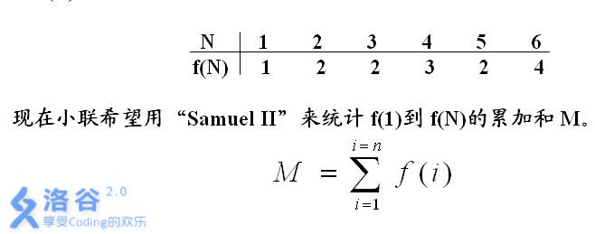

#### 题目描述
科学家们在Samuel星球上的探险得到了丰富的能源储备，这使得空间站中大型计算机“Samuel II”的长时间运算成为了可能。由于在去年一年的辛苦工作取得了不错的成绩，小联被允许用“Samuel II”进行数学研究。

小联最近在研究和约数有关的问题，他统计每个正数N的约数的个数，并以f(N)来表示。例如12的约数有1、2、3、4、6、12。因此f(12)=6。下表给出了一些f(N)的取值：

f(n)表示n的约数个数，现在给出n，要求求出f(1)到f(n)的总和。

#### 输入输出格式
##### 输入格式：
输入一行，一个整数n

##### 输出格式：
输出一个整数，表示总和